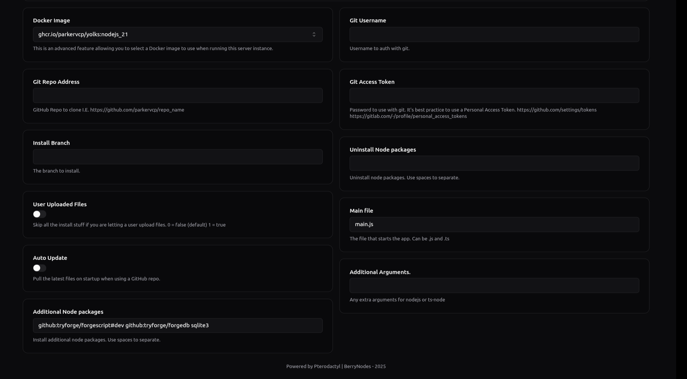

<h1 align="center">BotForge Setup Guide</h1>
This is an easy to understand guide to start your forging experience with BotForge.

## Contents
1. [Requirements](#requirements)
2. [Setups](#setups)
   1. [Pterodactyl/Pelican setup](#pterodactyl-setup)
   2. [VPS setup](#vps-setup)
   3. [Linux setup](#linux-setup)
   4. [Windows setup](#windows-setup)
   5. [Mac setup](#mac-setup)
   6. Android setup
      1. [Basic](#basic-android-setup) (Easier)
      2. [Advanced](#advanced-android-setup) (A bit difficult)
3. [Important](#important)
4. [Some tips](#tips)
5. [Support](#support)
## Requirements
I agree, it's a pain for the first timers. But yeah it's actually really, really simple. So just follow my steps carefully and keep in mind:
- Be patient, it can be really frustrating at times
- Always try to reason, ask questions, and try to answer them yourself.
- Try to get out of your little comfort zone
## Setups
Let's get the show on road, you know I'm a bit chatty type, so I'll break down stuff to you, so you can **learn**. Chose the one you use. Sorry but I don't bother making you a guide on how to know what your using.
### Pterodactyl setup
So for pterodactyl panel users, it's hate to break it to you, but it's kinda pain. But let's get started, I'll try to keep it simple. By the way it's painful, not difficult!
> [!NOTE]
> This guide assumes you've logged into your panel and your server installation is completed and your server egg is NodeJS v18 or higher.
1. Go to your server's **Startup** tab and just simply copy-paste this in the **Additional Node Packages** section add the following and make sure it looks like the image:
   ```bash
   github:tryforge/forgescript#dev github:tryforge/forgedb sqlite3
   ```
   <details><summary>Explanation</summary>
      
      All you've done is copy-pasted the above, these are the packages which the team at BotForge have made (`ForgeScript` and `ForgeDB`) which you need to install in order to use BotForge.

   Then why `Sqlite3`? Well, apparently the `ForgeDB` package requires `Sqlite3` for setup, in case you want to explore other ways to setup, feel free to see the offical [GitHub of ForgeDB](https://github.com/tryforge/forgedb?tab=readme-ov-file#effortless-installation).

    In case your wondering if you've done stuff right, then this is how it should look like:
      </details>
   
2. Now that you've done the above step head over to [BotForge's Client Generation Tool](https://tools.botforge.org/clientgen) and simply generate a main file for your project.
   <details><summary>Example main file</summary>
      
      ```js
      const { ForgeClient } = require("@tryforge/forgescript");const { ForgeDB } = require("@tryforge/forge.db)
      // Client initialization
      const client = new ForgeClient({
      // Intents
      "intents": [
    //"Guilds",
    //"GuildMembers",
    //"GuildModeration",
    //"GuildEmojisAndStickers",
    //"GuildIntegrations",
    //"GuildWebhooks",
    //"GuildInvites",
    //"GuildVoiceStates",
    //"GuildPresences",
    "GuildMessages",
    //"GuildMessageReactions",
    //"GuildMessageTyping",
    "DirectMessages",
    //"DirectMessageReactions",
    //"DirectMessageTyping",
    "MessageContent"
    //"GuildScheduledEvents",
    //"AutoModerationConfiguration",
    //"AutoModerationExecution"
    ],
      //Prefix
      "prefixes": ["?"],
      //Events
      "events": [
    //"autoModerationActionExecution",
    //"autoModerationRuleCreate",
    //"autoModerationRuleDelete",
    //"autoModerationRuleUpdate",
    //"channelCreate",
    //"channelDelete",
    //"channelPinsUpdate",
    //"channelUpdate",
    "debug",
    //"emojiCreate",
    //"emojiDelete",
    //"emojiUpdate",
    //"entitlementCreate",
    //"entitlementDelete",
    //"entitlementUpdate",
    "error",
    //"guildAuditLogEntryCreate",
    //"guildAvailable",
    //"guildBanAdd",
    //"guildBanRemove",
    //"guildCreate",
    //"guildDelete",
    //"guildMemberAdd",
    //"guildMemberAvailable",
    //"guildMemberRemove",
    //"guildMemberUpdate",
    //"guildScheduledEventCreate",
    //"guildScheduledEventDelete",
    //"guildScheduledEventUpdate",
    //"guildScheduledEventUserAdd",
    //"guildScheduledEventUserRemove",
    //"guildUnavailable",
    //"guildUpdate",
    "interactionCreate",
    //"inviteCreate",
    //"inviteDelete",
    "messageCreate",
    //"messageDelete",
    //"messageDeleteBulk",
    //"messagePollVoteAdd",
    //"messagePollVoteRemove",
    //"messageReactionAdd",
    //"messageReactionRemove",
    //"messageReactionRemoveAll",
    //"messageUpdate",
    //"messageReactionRemoveEmoji",
    //"presenceUpdate",
    "ready"
    //"roleCreate",
    //"roleDelete",
    //"roleUpdate",
    //"shardDisconnect",
    //"shardError",
    //"shardReady",
    //"shardReconnecting",
    //"shardResume",
    //"stageInstanceCreate",
    //"stageInstanceDelete",
    //"stageInstanceUpdate",
    //"stickerCreate",
    //"stickerDelete",
    //"stickerUpdate",
    //"threadCreate",
    //"threadDelete",
    //"threadMemberUpdate",
    //"threadUpdate",
    //"typingStart",
    //"userUpdate",
    //"voiceStateUpdate"
    ],
      //Extensions
   "extensions": [new ForgeDB()]})
      // Load stuff
      client.commands.load("commands/legacy");client.applicationCommands.load("commands/application")
      // Your bot token
      client.login("replace with your bot token");
      ```
   </details>
3. Now that your done with creating the main file, go to your server's panel, go to the **Files** tab and click on **New File** button and paste the main file you created.
4. Press the **Save File** button and name it `main.js`.
5. (Skip if already done) Now go to **Startup** tab again and make sure your **JS Main File** section it is `main.js`
6. Now that your done, head over to **Files** tab and make the folder named whatever you used in your main file for loading prefix commands and slash commands respectively using the **Create Directory** button appropriately.
   <details><summary>For those who used the main file provided by me</summary>
   
      After heading to **Files** tab, just simply make a folder named `commands` (in lowercase) and make folders named in it:
   - `legacy`: put the prefix commands in this folder
   - `application`: put the slash commands in this folder
   </details>
> [!WARNING]
> Make sure the prefix and slash command folders aren't same!
7. Now you can make commands, for functions and guides refer to the [Documentation](https://docs.botforge.org). In case you want to learn how to create a command, it's just simply go to the folder of the type of command you want to make for example:
   <details><summary>Prefix command</summary>

      Just simply go to the folder for your prefix commands (`commands/legacy` in case you used my main file) and make a new file for each new command, let's start off with a simple ping command, we'll name it `ping.js` and paste in the following:
   ```js
   module.exports={
    name: "ping", //name of the command
    type: "messageCreate", //event used for the command, messageCreate is for responding to prefix commands
    code: `
    $c[this is a comment]
    $pingms $c[the ping function returns the response time of the bot in milliseconds, for more info check the documentation!]
   `
   }
   ```
   </details>
   <details><summary>Slash command</summary>

      Just simply go to the folder for your slash commands (`commands/application` in case you used my main file) and make a new file for each new command, let's start off with a simple ping command, we'll name it `ping.js` and paste in the following:
   ```js
   module.exports={
    data: {
    name: "ping", //name of the command
    description: "see how fast am i", //description of the slash command
    type: 1 //the type of command, ude rauf.wtf/slash
    },
    code: `
    $c[this is a comment]
    $pingms $c[the ping function returns the response time of the bot in milliseconds, for more info check the documentation!]
   `
   }
   ```
   </details>

8. Now that your done with making commands, head over to **Console** tab and simply click on the **Run** button, it might take a bit of time in the beginning to start the bot. Now that your done, you'll have to invite the bot to a server and test it. I highly recommend using Berk's [Invite Permission Calculator](https://tools.botforge.org/permissions) tool.
### VPS setup
### Linux setup
### Windows setup
### Mac setup
1. Ensure you have homebrew installed, if you don't use the instructions here: https://brew.sh/
2. Open terminal and run `brew install nodejs`, this will install any necessary dependencies for nodejs which includes sqlite that we'll be using later. You can ensure this has been installed correctly by running `which node` and `node -v`, you should see something like `/opt/homebrew/bin/node` and `v24.5.0` respectively, of course these will vary depending on how brew is configured and when you installed nodejs.
3. Create a folder that will contain your new ForgeScript Bot, for the purposes of this guide, let's call it `mybot`. Assuming you're in the correct directory, run `mkdir mybot`, then navigate to it using `cd mybot`, you can verify this by running `pwd`, it will list the path of the directory you're in, with mybot at the end.
4. Open your editor of choice and navigate to the folder you created. Assuming you're using VSCode, run `code .` or open it in vsc manually, you should see a window similar to this: 
5. Open the terminal inside vsc using `ctrl` + `` ` ``
6. Run `npm i github:tryforge/forgescript#dev github:tryforge/forgedb sqlite3` to install the necessary dependencies. If you're running this for the first time this may take a few moments. You should see a message similar to this: 

> You may also see that there are some warnings, we will not cover how to address those here as they may cause issues with the bot, you're free to attempt to resolve those at your own risk.

7. Create a file named `main.js`, you can do this using the terminal again if you wish: `touch main.js`
8. Then create 3 folders named `commands`, `events`, and `extensions` using the following commands: `mkdir commands commands/events commands/extensions` Your output should look like this: 

 

You can also verify this by running the command `ls commands` in the terminal, and you should get an output similar to this: 
```sh
events          extensions
```

9. wip
### Basic Android setup
### Advanced Android setup
## Important
## Tips
## Support
